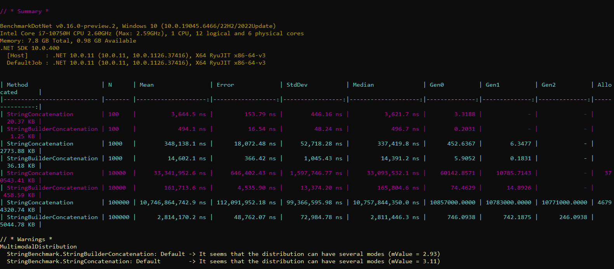
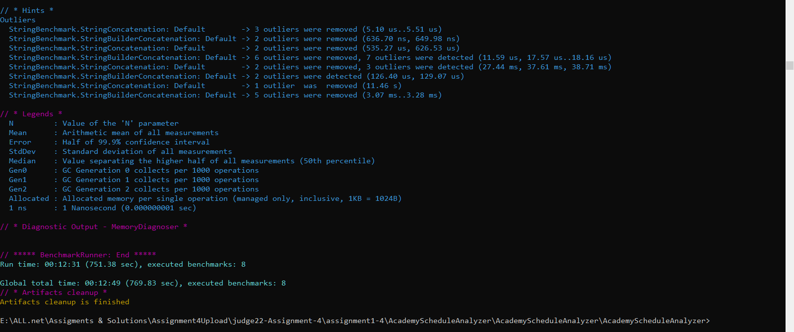

# Benchmark Analysis: String Concatenation vs StringBuilder

This benchmark compares the performance and memory efficiency of repeated string concatenation using the standard `+` operator (or `+=`) versus `StringBuilder` in C#.

## Benchmark Results

Below are the execution results obtained from running the benchmark on my machine (`dotnet run -c Release`):

| Method | N | Mean | Error | StdDev | Median | Gen0 | Gen1 | Gen2 | Allocated |
|---|---|---|---|---|---|---|---|---|---|
| StringConcatenation | 100 | 3,644.5 ns | 153.79 ns | 446.16 ns | 3,621.7 ns | 3.3188 | - | - | 20.37 KB |
| StringBuilderConcatenation | 100 | 494.1 ns | 16.54 ns | 48.24 ns | 496.7 ns | 0.2031 | - | - | 1.25 KB |
| StringConcatenation | 1000 | 348,138.1 ns | 18,072.48 ns | 52,718.28 ns | 337,419.8 ns | 452.6367 | 6.3477 | - | 2773.88 KB |
| StringBuilderConcatenation | 1000 | 14,602.1 ns | 366.42 ns | 1,045.43 ns | 14,391.2 ns | 5.9052 | 0.1831 | - | 36.18 KB |
| StringConcatenation | 10000 | 33,341,952.6 ns | 646,402.43 ns | 1,597,746.77 ns | 33,093,532.1 ns | 60142.8571 | 10785.7143 | - | 370543.41 KB |
| StringBuilderConcatenation | 10000 | 161,713.6 ns | 4,535.90 ns | 13,374.20 ns | 165,804.6 ns | 74.4629 | 14.8926 | - | 458.59 KB |
| StringConcatenation | 10000 | 10,746,864,742.9 ns | 112,091,952.18 ns | 99,366,595.98 ns | 10,757,844,350.0 ns | 10857000.0000 | 10783000.0000 | 10771000.0000 | 46794320.74 KB |
| StringBuilderConcatenation | 100000 | 2,814,170.2 ns | 48,762.07 ns | 72,984.78 ns | 2,811,446.3 ns | 746.0938 | 742.1875 | 246.0938 | 5044.78 KB |

---

## Performance & Allocation Analysis

### 1. Which approach was faster with 100 iterations?
* **StringBuilderConcatenation** was faster. It completed in **494.1 ns** compared to **3,644.5 ns** for string concatenation (~7.3x faster).

### 2. Which approach was faster with 100,000 iterations?
* **StringBuilderConcatenation** was exponentially faster. It took **2,814,170.2 ns** (~2.8 ms), whereas string concatenation took **10,746,864,742.9 ns** (~10.75 seconds). `StringBuilder` was approximately **3,818 times faster**.

### 3. Which approach allocated more memory?
* **String concatenation** allocated vastly more memory across all iteration counts:
  * At $N = 100$: `StringConcatenation` allocated **20.37 KB** vs **1.25 KB** for `StringBuilder`.
  * At $N = 100,000$: `StringConcatenation` allocated **~46.8 GB** in cumulative temporary allocations, compared to only **~5.04 MB** for `StringBuilder`.

### 4. What happened to string concatenation performance as the loop size increased?
* As $N$ increased, string concatenation performance degraded **quadratically ($O(N^2)$)** in execution time and memory allocations.
* Increasing $N$ from 10,000 to 100,000 caused execution time to jump from ~33.3 ms to ~10.75 seconds (~322x increase) and created massive Garbage Collection pressure across Gen0, Gen1, and Gen2.

### 5. Why does repeated string concatenation create additional allocations?
* Strings in C# are **immutable**.
* Every time the `+` or `+=` operator is evaluated inside a loop, .NET allocates a new string object on the heap, copies characters from the old string plus the new text, and discards the old string. This creates $N$ temporary allocations with total copy time of $O(N^2)$.

### 6. Why does StringBuilder usually perform better when text is repeatedly appended?
* `StringBuilder` uses a **mutable buffer** (character array) that can be modified in place without creating new string objects on every append.
* When capacity is exceeded, it grows by doubling its buffer, maintaining an amortized $O(1)$ append time ($O(N)$ overall).

### 7. Is StringBuilder always better than normal string operations? Explain.
* **No.** For simple, fixed concatenations (e.g., `string full = firstName + " " + lastName;`), the C# compiler optimizes this via `string.Concat`.
* Instantiating `StringBuilder` introduces minor object overhead which is unnecessary for non-looping, small string joins.